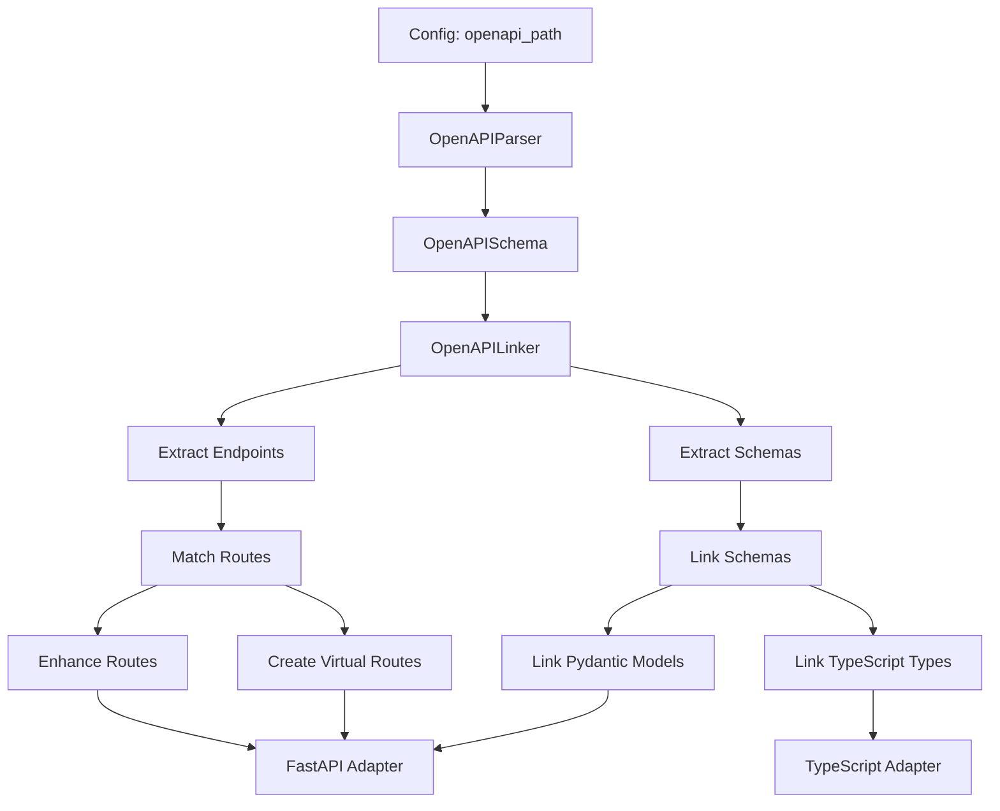

# dc-verifier (Data Chains Verifier)

[](https://opensource.org/licenses/MIT)
[](https://www.rust-lang.org/)
[](https://github.com/Sett11/dc-verifier)

A tool for verifying data chain integrity between application layers (Frontend → Backend → Database) **WITHOUT RUNNING the application**.

**dc-verifier** (also known as DCV) is a static analyzer that implements the Data Chains concept in practice.

## Concept

dc-verifier analyzes data flow through a call graph:
1. Finds entry points (main.py, app.py for Python; .ts/.tsx files for TypeScript)
2. Builds call graph: tracks imports → functions → classes → methods
3. Extracts data schemas (Pydantic models, Zod schemas, TypeScript interfaces)
4. Traverses the graph: main → route → handler → crud → model
5. Tracks data flow through the graph
6. Checks contracts at each stitch
7. Generates a report on mismatches

## Features

### Language and Framework Support
- ✅ **Python/FastAPI** - Python code parsing, FastAPI routes extraction, Pydantic models
  - Dynamic routes detection (fastapi_users and other route generators)
  - `response_model` extraction from decorators
  - Pydantic model import resolution (`app.schemas.*`)
  - Pydantic transformations tracking (`model_validate()`, `model_dump()`)
- ✅ **TypeScript** - TypeScript code parsing, extraction of imports, calls, functions, classes, methods, Zod schemas, interfaces and type aliases
  - TypeScript path mappings support (`@/app/...` from `tsconfig.json`)
  - Re-export support (`export * from`)
  - Optional chaining (`?.`) and nullish coalescing (`??`) handling
- ✅ **NestJS** - TypeScript backend framework support with decorator-based route extraction, DTO class validation, and parameter extraction

### Frontend Library Support

dc-verifier supports detection of API calls from various frontend libraries:

- ✅ **TanStack Query (React Query)** - `useQuery`, `useMutation` hooks with type extraction
- ✅ **SWR** - `useSWR`, `useSWRMutation` hooks with type extraction
- ✅ **RTK Query (Redux Toolkit Query)** - `*.use*Query()`, `*.use*Mutation()` patterns
- ✅ **tRPC** - `.useQuery()`, `.useMutation()` chain patterns
- ✅ **Apollo Client** - `useQuery`, `useMutation` with GraphQL queries
- ✅ **Next.js Server Actions** - `actions.*()` function calls
- ✅ **OpenAPI SDK Clients** - `client.get()`, `client.post()`, `client.delete()`, `client.patch()`, `client.put()` from generated OpenAPI clients
  - SDK file detection (`sdk.gen.ts`, `openapi-client`, `api-client`)
  - SDK function tracking through re-exports
  - Automatic API call extraction from SDK function bodies
- ✅ **Generic patterns** - `fetch()`, `axios.*()`, `api.*()`, `client.*()`

### OpenAPI Integration

dc-verifier supports OpenAPI schema integration for enhanced route detection and schema linking between Frontend and Backend.

- ✅ **Schema Parsing** - Automatic parsing of OpenAPI JSON schemas
- ✅ **Route Enhancement** - Improved route detection by matching discovered routes with OpenAPI endpoints
- ✅ **Virtual Routes** - Automatic creation of virtual route nodes for OpenAPI endpoints not found in code
- ✅ **Schema Linking** - Links TypeScript types and Pydantic models through OpenAPI schema components
- ✅ **SDK Client Support** - Detects API calls from OpenAPI-generated SDK clients
- ✅ **Global and Per-Adapter Configuration** - Support for global `openapi_path` and adapter-specific overrides

### Code Analysis
- ✅ **Call graph building** - automatic graph construction for Python and TypeScript projects
- ✅ **Data flow tracking** - tracks parameters and return values through the graph
- ✅ **Contract checking** - verifies data schema compliance at chain stitches

### Reports and Visualization
- ✅ **Report formats** - generates reports in Markdown (default) or JSON format
- ✅ **Graph visualization** - generates DOT format for call graph visualization
- ✅ **Progress bars** - visual feedback for long-running operations

### Performance and Configuration
- ✅ **Caching** - saves and loads graphs to speed up repeated checks
- ✅ **Recursion depth limiting** - configurable `max_recursion_depth` for large projects
- ✅ **Flexible configuration** - supports multiple adapters and validation rules
- ✅ **Configuration validation** - detailed error messages for incorrect configuration
- ✅ **Typed errors** - uses `thiserror` for better error handling

## Installation

> **Note for developers:** If you cloned the repository for development, use the links below or use a local build.

### Method 1: Install via Cargo (recommended)

If you have Rust and Cargo installed:

```bash
cargo install dc-verifier
```

> **Note:** To install via `cargo install`, the project must be published on [crates.io](https://crates.io). Until the project is published, use other installation methods.

After installation, `dc-verifier` will be available in PATH.

### Method 2: Build from source

Clone the repository and build the project:

```bash
git clone https://github.com/Sett11/dc-verifier.git
cd dc-verifier
cargo build --release
```

The binary will be located at `target/release/dc-verifier` (or `target/release/dc-verifier.exe` on Windows).

### Method 3: Download pre-built release

Download a pre-built binary for your platform from [Releases](https://github.com/Sett11/dc-verifier/releases):

- **Linux**: `dc-verifier-x86_64-unknown-linux-gnu.tar.gz`
- **macOS**: `dc-verifier-x86_64-apple-darwin.tar.gz` or `dc-verifier-aarch64-apple-darwin.tar.gz`
- **Windows**: `dc-verifier-x86_64-pc-windows-msvc.zip`

Extract the archive and add the binary to PATH or use the full path to it.

### Requirements

- **Rust 1.70+** (only for building from source)
- **Python 3.8+** (for FastAPI project analysis)
- **Node.js** (not required, but may be useful for TypeScript projects)

## Usage

### Initialize Configuration

```bash
dc-verifier init
```

Creates a `dc-verifier.toml` file with a configuration example.

### Check Chains

```bash
# Markdown format (default)
dc-verifier check

# JSON format
dc-verifier check --format json
```

Checks data chains according to the configuration and generates a report in Markdown or JSON format. Progress bars are displayed during execution to track adapter processing and contract checking.

### Visualize Graphs

```bash
dc-verifier visualize
```

Generates DOT files for call graph visualization. Files can be opened in Graphviz or online tools.

## Project Structure

- `crates/dc-core/` - Core: graph building, data flow analysis, parsers, analyzers
- `crates/dc-adapter-fastapi/` - FastAPI adapter (Python)
- `crates/dc-adapter-nestjs/` - NestJS adapter (TypeScript backend)
- `crates/dc-typescript/` - TypeScript adapter (frontend)
- `crates/dc-cli/` - CLI tool

## Configuration

Example configuration for a project with Python/FastAPI and TypeScript:

```toml
project_name = "my-project"

# Maximum recursion depth (optional, None = unlimited)
# Useful for large projects to avoid infinite recursion
# max_recursion_depth = 100

# Global OpenAPI schema path (optional, applies to all adapters)
# Can be overridden per adapter
# openapi_path = "openapi.json"

[output]
format = "markdown"  # or "json"
path = "dc-verifier-report.md"

[[adapters]]
type = "fastapi"
app_path = "app/main.py"
# Optional: override global openapi_path for this adapter
# openapi_path = "backend/openapi.json"

[[adapters]]
type = "typescript"
src_paths = ["frontend/src", "shared"]
# Uses global openapi_path or can override
# openapi_path = "frontend/openapi.json"

[rules]
type_mismatch = "critical"      # Type mismatch checking
missing_field = "warning"        # Missing field checking
unnormalized_data = "warning"   # Data normalization checking
```

### Adapters

#### FastAPI Adapter

```toml
[[adapters]]
type = "fastapi"
app_path = "app/main.py"  # Path to FastAPI application file
# Optional: OpenAPI schema path (overrides global openapi_path if set)
# openapi_path = "openapi.json"
```

The FastAPI adapter supports:
- Dynamic routes detection (fastapi_users and other route generators)
- `response_model` extraction from decorators
- Pydantic model import resolution
- Pydantic transformations tracking

#### TypeScript Adapter

```toml
[[adapters]]
type = "typescript"
src_paths = ["src", "lib"]  # Directories with TypeScript files
# Optional: OpenAPI schema path (overrides global openapi_path if set)
# openapi_path = "openapi.json"
```

The TypeScript adapter supports:
- TypeScript path mappings from `tsconfig.json` (`@/app/...`)
- Re-export handling (`export * from`)
- OpenAPI SDK client call detection
- Multiple frontend library patterns

#### NestJS Adapter

```toml
[[adapters]]
type = "nestjs"
src_paths = ["src"]  # Directories with NestJS TypeScript files
# Optional: OpenAPI schema path (overrides global openapi_path if set)
# openapi_path = "openapi.json"
```

The NestJS adapter supports:
- Decorator-based route extraction (`@Controller`, `@Get`, `@Post`, etc.)
- DTO class extraction with class-validator decorators
- Parameter extraction from `@Body()`, `@Query()`, `@Param()` decorators
- Request/response type inference from method signatures

**Note:** The configuration uses the `type` field (not `adapter_type`), which is automatically mapped to `adapter_type` when loading the configuration.

### Validation Rules

Validation rules define the severity level for different types of mismatches:

```toml
[rules]
type_mismatch = "critical"     # Type mismatch checking (critical/warning/info)
missing_field = "warning"       # Missing field checking (critical/warning/info)
unnormalized_data = "warning"  # Data normalization checking (critical/warning/info)
```

## Tests

- **Run all tests**: `cargo test --all`
- **More details**: see `TESTING.md` for an overview of unit, integration and regression tests (FastAPI/Pydantic/SQLAlchemy, TypeScript/Zod/OpenAPI, imports, reporters).

These rules are used to determine severity in contracts and affect the final statistics in reports.

## OpenAPI Integration

dc-verifier supports OpenAPI schema integration for enhanced route detection and schema linking between Frontend and Backend.

### Features

- **Schema Parsing**: Automatic parsing of OpenAPI JSON schemas
- **Route Enhancement**: Improved route detection by matching discovered routes with OpenAPI endpoints
- **Virtual Routes**: Automatic creation of virtual route nodes for OpenAPI endpoints not found in code
- **Schema Linking**: Links TypeScript types and Pydantic models through OpenAPI schema components
- **SDK Client Support**: Detects API calls from OpenAPI-generated SDK clients

### Configuration

OpenAPI schema can be specified globally or per-adapter:

```toml
# Global OpenAPI schema (applies to all adapters)
openapi_path = "openapi.json"

[[adapters]]
type = "fastapi"
app_path = "backend/app/main.py"
# Can override for specific adapter
# openapi_path = "backend/openapi.json"

[[adapters]]
type = "typescript"
src_paths = ["frontend/src"]
# Uses global openapi_path or can override
# openapi_path = "frontend/openapi.json"
```

### How It Works

1. **Schema Parsing**: OpenAPI schema is parsed and endpoints/schemas are extracted
2. **Route Matching**: Discovered routes are matched against OpenAPI endpoints
3. **Enhancement**: Route information is enriched with OpenAPI schema data
4. **Virtual Routes**: Missing OpenAPI endpoints are created as virtual routes
5. **Schema Linking**: Frontend TypeScript types and Backend Pydantic models are linked via OpenAPI schemas

### Architecture



## Usage Examples

### Python/FastAPI Project

```bash
# 1. Create configuration
dc-verifier init

# 2. Configure dc-verifier.toml
# Specify path to FastAPI application

# 3. Run check
dc-verifier check

# 4. View report
cat dc-verifier-report.md

# Or generate JSON report
dc-verifier check --format json
cat dc-verifier-report.json
```

### TypeScript Project

```bash
# 1. Create configuration
dc-verifier init

# 2. Configure dc-verifier.toml
# Specify directories with TypeScript files

# 3. Run check
dc-verifier check

# 4. Visualize graph
dc-verifier visualize
# Open generated .dot file in Graphviz or online tools

# 5. Check chains with JSON report
dc-verifier check --format json
```

### NestJS Project

```bash
# 1. Create configuration
dc-verifier init

# 2. Configure dc-verifier.toml
# Specify directories with NestJS TypeScript files

# 3. Run check
dc-verifier check

# 4. View report
cat dc-verifier-report.md
```

**Example configuration for NestJS:**

```toml
project_name = "nestjs-api"

[output]
format = "markdown"
path = "dc-verifier-report.md"

[[adapters]]
type = "nestjs"
src_paths = ["src"]

[rules]
type_mismatch = "critical"
missing_field = "warning"
```

### Mixed Project (Python + TypeScript)

```toml
project_name = "fullstack-app"

# Recursion depth limit for large projects
max_recursion_depth = 150

# Global OpenAPI schema (applies to all adapters)
openapi_path = "openapi.json"

[output]
format = "json"  # Use JSON format for CI/CD integration
path = "dc-verifier-report.json"

[[adapters]]
type = "fastapi"
app_path = "backend/app/main.py"
# Can override openapi_path for specific adapter
# openapi_path = "backend/openapi.json"

[[adapters]]
type = "typescript"
src_paths = ["frontend/src"]
# Uses global openapi_path or can override

[rules]
type_mismatch = "critical"
missing_field = "warning"
unnormalized_data = "info"
```

## Advanced Features

### Dynamic Routes Detection

dc-verifier automatically detects dynamically generated routes in FastAPI applications:

- **fastapi_users** - Detects routes generated by `fastapi_users` library
- **Route Generators** - Supports custom route generators that use `app.include_router()`
- **Virtual Route Nodes** - Creates route nodes for dynamically generated endpoints

### OpenAPI Schema Linking

OpenAPI schemas serve as a bridge between Frontend and Backend:

- **Type Matching** - Matches TypeScript types with Pydantic models through OpenAPI schema components
- **Schema Validation** - Validates that discovered routes match OpenAPI endpoints
- **Missing Endpoint Detection** - Identifies routes in code that are not in OpenAPI and vice versa

### SDK Function Tracking

For OpenAPI-generated SDK clients:

- **Function Detection** - Tracks SDK functions through re-exports (`export * from`)
- **API Call Extraction** - Analyzes SDK function bodies to extract API calls (`client.get()`, `client.post()`, etc.)
- **SDK File Recognition** - Automatically recognizes SDK files (`sdk.gen.ts`, `openapi-client`, `api-client`)

### Import Resolution

Enhanced import resolution for better code analysis:

- **TypeScript Path Mappings** - Resolves `@/app/...` imports using `tsconfig.json` paths
- **Re-export Handling** - Tracks functions and types through `export * from` statements
- **Python Import Resolution** - Resolves relative and absolute imports for Pydantic models
- **Recursion Depth Control** - Prevents infinite loops in complex re-export chains

## What is Checked

dc-verifier checks the following aspects of data chains:

1. **Type compliance** - verifies that data types match at chain stitches
2. **Required fields** - verifies that all required fields are present
3. **Data normalization** - checks validation (email, URL, patterns)
4. **Decorator validation** - verifies NestJS decorators and DTO class validation rules
5. **OpenAPI compliance** - verifies that discovered routes match OpenAPI specification
6. **Schema linking** - verifies linking between TypeScript types and Pydantic models through OpenAPI

## Report Formats

dc-verifier supports two report formats:

### Markdown (default)
- **Human-readable format** with emojis and formatting
- Includes statistics (total_chains, critical_issues, warnings, valid_chains)
- Detailed information about each chain with data paths and checked stitches
- Usage: `dc-verifier check` or `dc-verifier check --format markdown`

### JSON
- **Machine-readable format** for CI/CD integration and other tools
- Includes report version, timestamp (RFC3339), summary and full chain data
- Structured format for automated processing
- Usage: `dc-verifier check --format json`

Both formats contain the same information, but are presented in different formats for convenience.

## Requirements

- Rust 1.70+
- Python 3.8+ (for FastAPI adapter)
- Node.js (not required, but may be useful for TypeScript projects)

## Project Status

The project is ready for use. Current readiness: **~98-100%**.

### Implemented

- ✅ Python and TypeScript code parsing
- ✅ Call graph building for Python and TypeScript
- ✅ Function, class and method extraction from TypeScript AST
- ✅ TypeScript interface and type alias extraction
- ✅ Zod schema linking with TypeScript types
- ✅ TypeScript schema parsing to JsonSchema
- ✅ NestJS adapter with decorator-based route extraction
- ✅ DTO class extraction with class-validator support
- ✅ Frontend library support (SWR, RTK Query, tRPC, Apollo Client, Next.js)
- ✅ Enhanced decorator processing for NestJS
- ✅ Parameter extraction from decorators (@Body, @Query, @Param)
- ✅ Data flow tracking
- ✅ Contract checking
- ✅ Graph visualization
- ✅ Graph caching
- ✅ CLI interface
- ✅ Configuration validation with detailed error messages (`Config::validate()`)
- ✅ Recursion depth limiting for large projects (`max_recursion_depth` in config)
- ✅ Progress bars for long-running operations (`indicatif::ProgressBar` in `check` and `visualize`)
- ✅ JSON report format (option `--format json`, `JsonReporter`)
- ✅ Improved error handling (typed errors via `thiserror`)
- ✅ Unit and integration tests (all tests pass)
- ✅ OpenAPI schema parsing and linking (`OpenAPIParser`, `OpenAPILinker`)
- ✅ OpenAPI SDK client call detection (`client.get()`, `client.post()`, etc.)
- ✅ Dynamic FastAPI routes detection (fastapi_users and other generators)
- ✅ TypeScript path mappings support (`@/app/...` from `tsconfig.json`)
- ✅ Pydantic model transformations tracking (`model_validate()`, `model_dump()`)
- ✅ Enhanced import resolution for TypeScript and Python
- ✅ Virtual route creation from OpenAPI endpoints
- ✅ SDK function tracking through re-exports
- ✅ FastAPI `response_model` extraction from decorators

### Planned

- ⚠️ Additional OpenAPI generators support (openapi-typescript-codegen, swagger-typescript-api)
- ⚠️ GraphQL schema support

## License

See LICENSE file (or Cargo.toml for license information).

## Contribution

The project is open for contributions! See details in [CONTRIBUTING.md](CONTRIBUTING.md).

**Important:** When adding new features or modifying existing ones, please update:
- `README.md` - feature descriptions and usage examples
- `CHANGELOG.md` - change history in Keep a Changelog format
